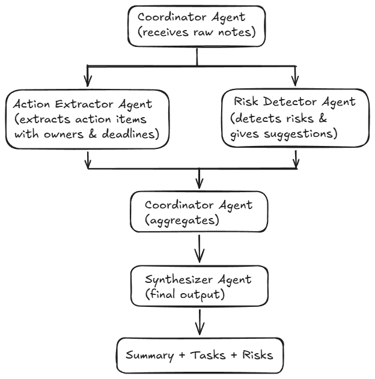

# Meeting Insights AI

Meeting Insights AI turns raw meeting notes into a structured outcome:

- **Summary** of what happened
- **Tasks / action items** (task, owner, deadline)
- **Risks / blockers** (issue, impact, suggestion)

It is implemented as a small **agent pipeline** (multiple LLM prompts with a coordinator) and can be run either via a CLI script or a Streamlit UI.

---

## Agent-to-agent flow

This application uses a hub-and-spoke multi-agent architecture where a coordinator distributes raw meeting notes to specialized agents. Each agent performs a focused task, and the results are aggregated and passed to a synthesizer to generate a clean structured output.



At a high level, the flow looks like this:

1. **Input**: user provides meeting notes (plain text)
2. **Coordinator** (`src/agents/coordinator_agent.py`):
    - calls the **Action Extractor Agent** (`src/agents/action_extractor_agent.py`) to extract action items
    - calls the **Risk Detector Agent** (`src/agents/risk_detector_agent.py`) to extract risks / blockers
    - merges both outputs into one intermediate structure:
        - `notes`
        - `actions` (list)
        - `risks` (list)
3. **Synthesizer Agent** (`src/agents/synthesizer_agent.py`):
    - takes the coordinator output and asks the LLM to produce final JSON:
        - `summary`
        - `tasks`
        - `risks`
4. **Formatting (UI)**:
    - the Streamlit app uses `src/util/output_formatter.py` to convert the final JSON into readable text with headings.

---

## Project structure (key files)

- `main.py` — CLI entrypoint + `generate_insights(notes)` function used by the UI
- `main_ui.py` — Streamlit UI
- `src/agents/`
    - `coordinator_agent.py`
    - `action_extractor_agent.py`
    - `risk_detector_agent.py`
    - `synthesizer_agent.py`
- `src/util/llm_adapter.py` — Azure OpenAI chat call
- `src/util/output_formatter.py` — converts JSON output → human-readable Markdown
- `resources/application.yml` — configuration template (env-var placeholders)

---

## Setup

Install dependencies:

```powershell
python -m pip install -r .\requirements.txt
```

---

## Run (CLI)

```powershell
python .\main.py
```

Paste/type meeting notes and finish with an empty line.

---

## Run (Streamlit UI)

```powershell
streamlit run .\main_ui.py
```

---

## Configuration (Azure OpenAI)

The LLM calls are made through Azure OpenAI (`src/util/llm_adapter.py`). Configuration is loaded by `src/config_loader.py`.

- `resources/application.yml` contains placeholders like `${ENV_VAR_NAME}`
- Values are expected to be available via a `.env` file at the project root and/or normal environment variables

Common required values are:

- `api_key`
- `azure_endpoint`
- `api_version`

If configuration is missing, the app will fail when it tries to call the model.

---

## Notes

- The agent prompts ask the model to return JSON. The UI renders it as readable text.
- If you want the UI to show raw JSON instead, you can swap the renderer in `main_ui.py`.

 